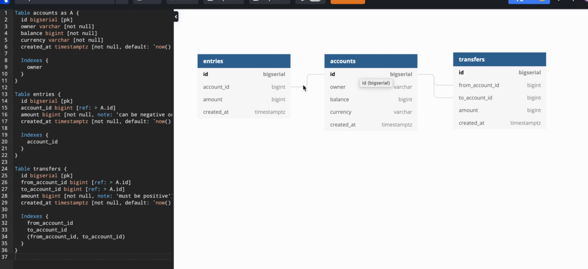
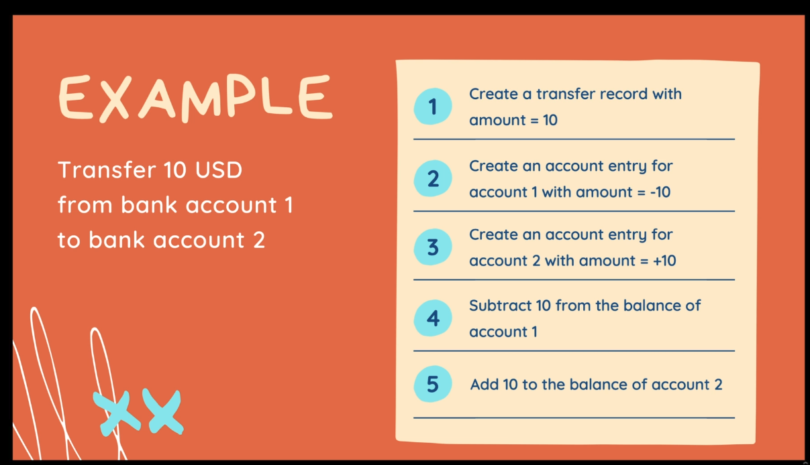
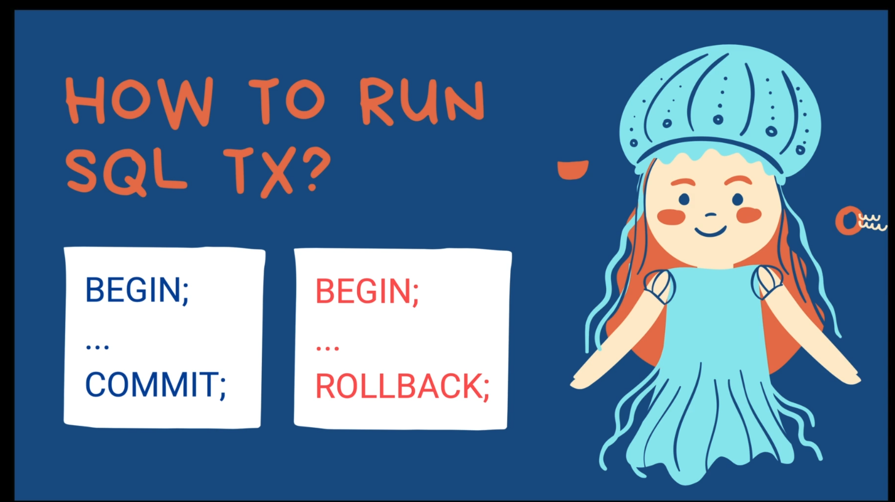
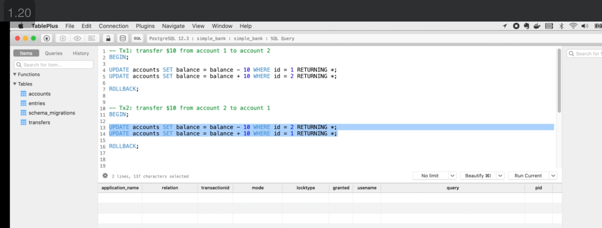
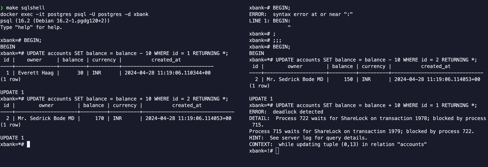

# XBank [Golang + Postgres + gRPC + Kubernetes]


## Setup


### Tools 
 - Docker
 - Postgres
 - TablePlus/Azure Data Studio
 - [Golang Migrate](https://github.com/golang-migrate/migrate)
 - [sqlc](https://sqlc.dev/) 
```shell 
brew install sqlc
```
 - [Golang Postgres Driver for database/sql](https://github.com/lib/pq)


### Section 1 Highlights
 - DB Schema can be created using dbdiagram.io
    
 - Docker, Postgres(Docker Version), TablePlus or Azure Data Studio Installation
 - `sqlc` can be used to generate the Golang Code (check db/query folder for sql queries and db/sqlc for generated Golang code)
 - Added Unit Tests for all CRUD operations (Accounts, Entries, Transfers TABLES)
 - What is a DB Transaction
   - A transaction in SQL is a sequence of one or more operations such as insertions, updates, or deletions, performed on a database as a single unit of work.
   
   
 - Deadlock can occur while executing the transactions
   
  
 -  


### Section 2 Highlights
